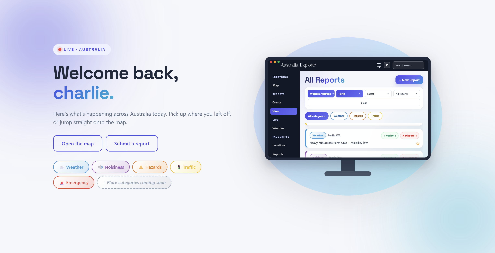
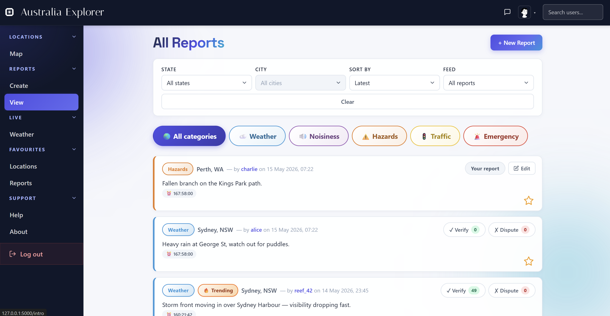
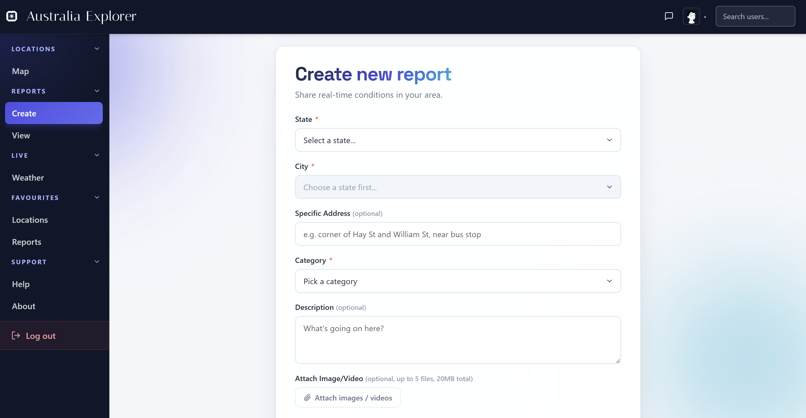
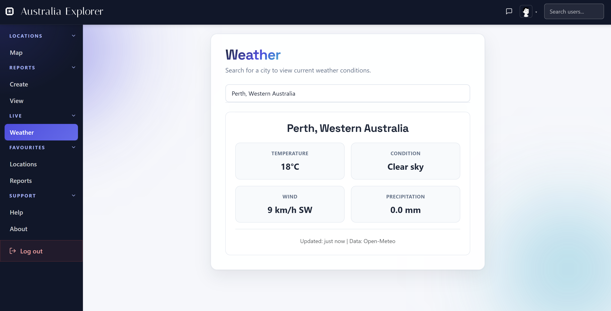

# CITS3403 Project

## Description
A Flask web app for community-based local condition reporting, letting users share, browse, verify and discuss short-lived reports across Australian cities.

## Screenshots
Screenshots of the main application pages are shown below.









## Features
- Browse local reports by location, category and feed type.
- Create reports with descriptions, locations and media uploads.
- Verify or dispute reports to support community credibility.
- Comment on reports and view trending local updates.
- Save favourite reports and locations.
- Manage user profiles, followers, messages and account settings.
- View supported cities on an interactive Leaflet map.
- Check live weather using the Open-Meteo API.
- Automatically expire reports after seven days.
- Validate authentication, uploads, permissions and report actions server-side.

## Tech Stack
- Python
- Flask
- Flask-SQLAlchemy
- SQLAlchemy
- Flask-Migrate / Alembic
- Flask-Login
- Flask-WTF / WTForms
- SQLite
- Bootstrap
- Leaflet
- Jinja templates
- Pytest
- Selenium

## Setup
These instructions assume Python is installed and that commands are run from the project root.

**Step 1: Create and activate a virtual environment**

```powershell
python -m venv venv
.\venv\Scripts\activate
```

**Step 2: Install dependencies**

```powershell
pip install -r requirements.txt
```

**Step 3: Initialise local environment settings**

```powershell
python init_env.py
```

This creates a local `.env` file containing a random `SECRET_KEY`. The `.env` file is ignored by Git, so each developer can keep their own private key.

**Step 4: Apply database migrations**

```powershell
$env:FLASK_APP = "run.py"
flask db upgrade
```

If the migration history still has multiple heads before the merge migration is committed, use:

```powershell
flask db upgrade heads
```

## Run

Optional: seed the demo data before starting the app.

```powershell
python -m seed.demo_data
```

Start the application with:

```powershell
flask run
```

Then open on your browser:

```text
http://127.0.0.1:5000
```

On first launch after the database tables exist, the app seeds default categories, Australian states and cities, and a small set of test users and sample reports.

## Test Instructions

Run all tests with:

```powershell
pytest
```

Run only the unit tests with:

```powershell
pytest tests/unit
```

Run only the Selenium browser tests with:

```powershell
pytest tests/selenium
```

The Selenium tests require Google Chrome to be installed. The test suite creates isolated test databases and upload folders, so it does not use the normal development database.

## Contributions

| UWA ID | Name | GitHub Username | Contributions |
| --- | --- | --- | --- |
| 24314826 | Jonathan Abraham | jono1762 | Map, live weather, favourites, support pages and UI |
| 24116757 | Zi Hao Chan | Ziihaooo | Homepage, profiles, UI, security, database and testing |
| 23446652 | Tyler Yeoh | Nylernothere | Reports pages, UI and app logo |
